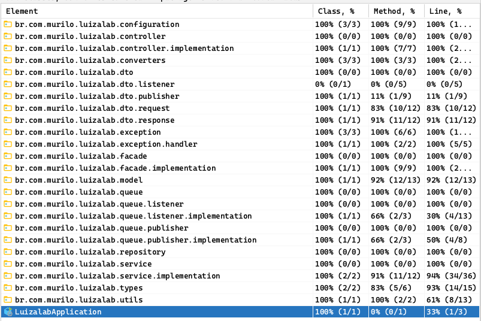

# Luiza labs communication platform :sunglasses:

This application was developed for luiza labs test for a backend position.

## Running Local

:arrow_right: `mvn clean install` - to generate the jar file and run all the tests.

:arrow_right: `docker-compose up --build` - to run the application;

## Architecture

This application was developed using the following stack:

:arrow_right: **Spring boot**

:arrow_right: **Spring data jpa**

:arrow_right: **Lombok**

:arrow_right: **PostgreSQL**

:arrow_right: **RabbitMQ**

:arrow_right: **Docker**

:arrow_right: **Swagger**

:arrow_right: **JUnit**

:arrow_right: **Maven**

## Documentation

:arrow_right: [Postman Files](./postman-files)

## Test coverage
